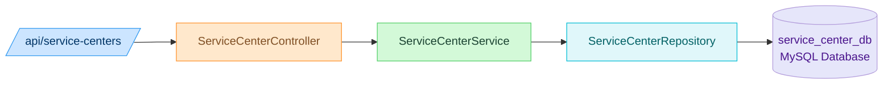
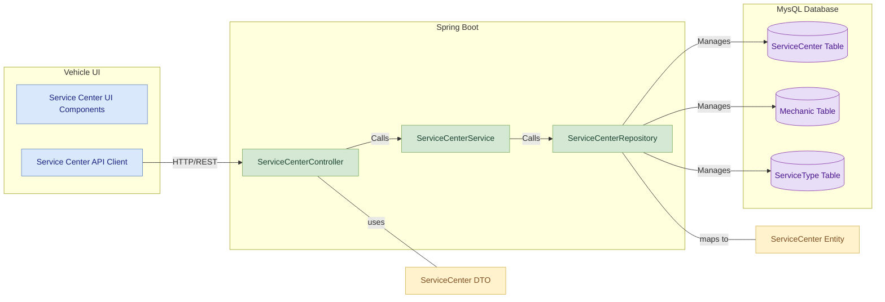
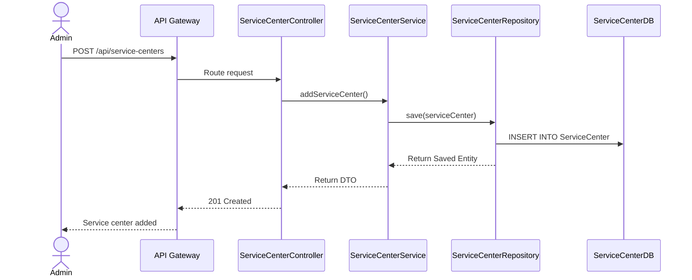

# Service Center Management Service

## Contributor
- Rajvardhan Shinde

## 📚 Table of Contents
- [Overview](#overview)
- [Features](#features)
- [Folder Structure](#folder-structure)
- [REST API Endpoints](#rest-api-endpoints)
- [Data Model](#data-model)
- [Module Architecture Diagram](#module-architecture-diagram)
- [Component Diagram](#component-diagram)
- [Sequence Diagram](#sequence-diagram)
- [Swagger Documentation](#swagger-documentation)
- [Run Locally](#run-locally)
  
---

## Overview

The Service Center Management Service is a Spring Boot microservice responsible for managing service centers, mechanics, and service types in the Vehicle Management System. It provides RESTful APIs for CRUD operations and integrates with other services like the ServiceCenter Service via Feign Clients. It is registered with Eureka and routed through the API Gateway.

---

## Features

- Add and manage service centers
- Register and list mechanics per center
- Define and retrieve service types
- Communicate with other services via Feign Clients
- Integrated with Eureka Discovery and API Gateway

---

## Folder Structure

```plaintext
src/
└── main/
    ├── java/
    │   └── com.vehicle.servicecenter/
    │       ├── config/           # Configuration classes (e.g., Feign, Swagger)
    │       ├── controller/       # REST controllers
    │       ├── dto/              # Data Transfer Objects
    │       ├── entity/           # JPA Entities
    │       ├── repository/       # Spring Data Repositories
    │       └── service/          # Business logic layer
    └── resources/
        └── application.properties  # App configuration
```

---

## REST API Endpoints

| Method | Endpoint                                 | Description                          |
|--------|------------------------------------------|--------------------------------------|
| POST   | `/api/service-centers`                   | Add a new service center             |
| GET    | `/api/service-centers`                   | List all service centers             |
| GET    | `/api/service-centers/{id}`              | Get service center details           |
| POST   | `/api/service-centers/{id}/mechanics`    | Add mechanic to a center             |
| GET    | `/api/service-centers/{id}/mechanics`    | List mechanics in a center           |
| POST   | `/api/service-types`                     | Define a new service type            |
| GET    | `/api/service-types`                     | List all service types               |

---

## Data Model

### ServiceCenter Entity

| Field Name        | Type           | Description                              |
|-------------------|----------------|------------------------------------------|
| `serviceCenterId` | INT            | Primary Key, unique identifier           |
| `name`            | VARCHAR(100)   | Name of the service center               |
| `location`        | VARCHAR(255)   | Physical address                         |
| `contact`         | VARCHAR(50)    | Contact number or email                  |

### Mechanic Entity

| Field Name        | Type           | Description                              |
|-------------------|----------------|------------------------------------------|
| `mechanicId`      | INT            | Primary Key, unique identifier           |
| `serviceCenterId` | INT            | Foreign Key referencing `ServiceCenterID`|
| `name`            | VARCHAR(100)   | Full name of the mechanic                |
| `expertise`       | VARCHAR(100)   | Area of specialization                   |

### ServiceType Entity

| Field Name        | Type           | Description                              |
|-------------------|----------------|------------------------------------------|
| `serviceTypeId`   | INT            | Primary Key, unique identifier           |
| `description`     | TEXT           | Description of the service               |
| `price`           | DECIMAL(10,2)  | Cost of the service                      |

---

## Module Architecture Diagram




_This diagram illustrates the layered architecture:_

- API Gateway routes requests
- ServiceCenterController handles HTTP requests
- Business logic sits in ServiceCenterService
- Data access is handled by ServiceCenterRepository
- Data is persisted to a MySQL database
- The service is registered with Eureka for discovery


## Component Diagram



---

## Sequence Diagram



## Swagger Documentation
The User Service provides interactive API documentation using Swagger.

### Access Swagger UI
Swagger UI for User Service
    - http://localhost:8085/swagger-ui/index.html


---

## Run Locally

```bash
# Backend
cd service-center-service
mvn clean install
mvn spring-boot:run
```
