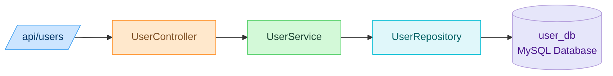
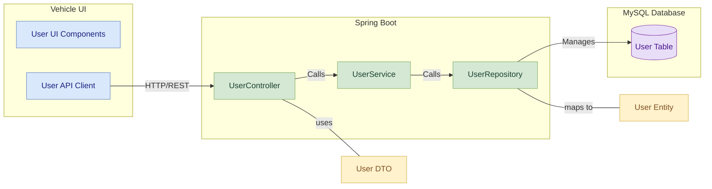
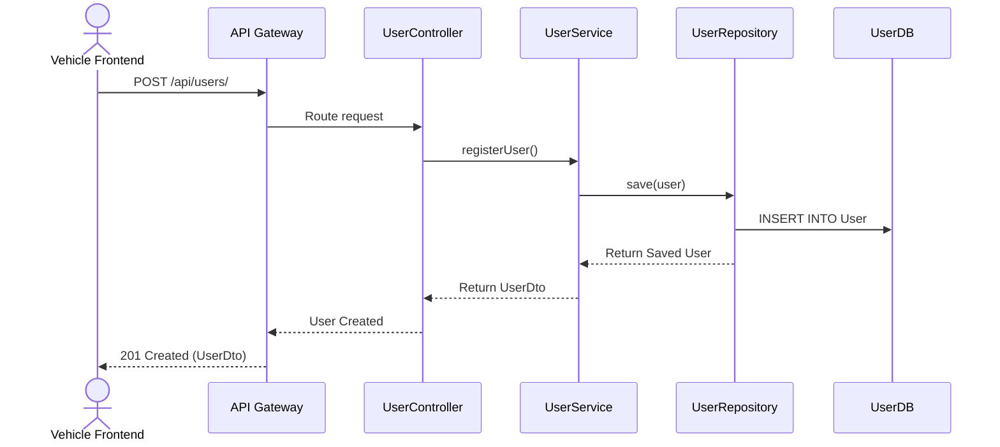

# User Service

## Contributor
- Siddhi Kate

## 📚 Table of Contents
- [Overview](#overview)
- [Features](#features)
- [Folder Structure](#folder-structure)
- [REST API Endpoints](#rest-api-endpoints)
- [Data Model](#data-model)
- [Module Architecture Diagram](#module-architecture-diagram)
- [Component Diagram](#component-diagram)
- [Sequence Diagram](#sequence-diagram)
- [Swagger Documentation](#swagger-documentation)
- [Run Locally](#run-locally)

---

## Overview
The User Service is a Spring Boot microservice within the Vehicle Management System. It handles user registration, profile management, and vehicle association. It communicates with the Vehicle Service via Feign Client and is registered with Eureka for service discovery.

---

## Features

- Register new users with personal details
- View and update user profiles
- Associate users with vehicles
- Retrieve service history linked to users
- Search users by email or list all users
- Integrated with Eureka Discovery
- Routed via API Gateway

---

## Folder Structure

```plaintext
src/
└── main/
    ├── java/
    │   └── com.vehicle.user/
    │       ├── config/            # Configuration classes (e.g., Feign, Swagger)
    │       ├── controller/        # REST controllers
    │       ├── dto/               # Data Transfer Objects
    │       ├── entity/            # JPA Entities
    │       ├── repository/        # Spring Data Repositories
    │       └── service/           # Business logic layer
    └── resources/
        └── application.properties  # App configuration
```

---

## REST API Endpoints

| Method | Endpoint                          | Description                                |
|--------|-----------------------------------|--------------------------------------------|
| POST   | `/api/users/`                     | Register a new user                        |
| GET    | `/api/users/{email}`              | Retrieve user by email                     |
| GET    | `/api/users`                      | Retrieve all users                         |
| GET    | `/api/users/{userId}/vehicles`    | Retrieve vehicles associated with a user   |

---

## Data Model

### User Entity

| Field Name     | Data Type      | Description                              |
|----------------|----------------|------------------------------------------|
| `userId`       | BIGINT         | Primary Key, auto-generated              |
| `name`         | VARCHAR(255)   | Name of the user                         |
| `email`        | VARCHAR(255)   | Must be unique                           |
| `phone`        | VARCHAR(15)    | Phone number                             |
| `address`      | VARCHAR(255)   | Address of the user                      |
| `passwordHash` | VARCHAR(255)   | Hashed password                          |

---

## Module Architecture Diagram



_This diagram illustrates the layered architecture:_

- API Gateway routes requests  
- UserController handles HTTP requests  
- Business logic sits in UserService  
- Data access is handled by UserRepository  
- Data is persisted to an MySQL database  
- The service is registered with Eureka for discovery

---

## Component Diagram



---

## Sequence Diagram

### User Registration



---

## Swagger Documentation

The User Service provides interactive API documentation using Swagger.

### Access Swagger UI

- Swagger UI for User Service-
      http://localhost:8082/swagger-ui/index.html

---

## Run Locally

```bash
# Backend
cd user-service
mvn clean install
mvn spring-boot:run
```

---
