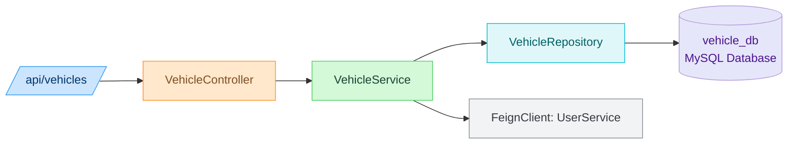
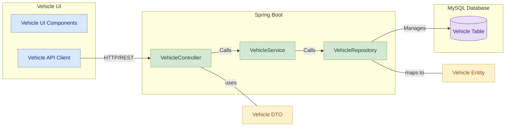
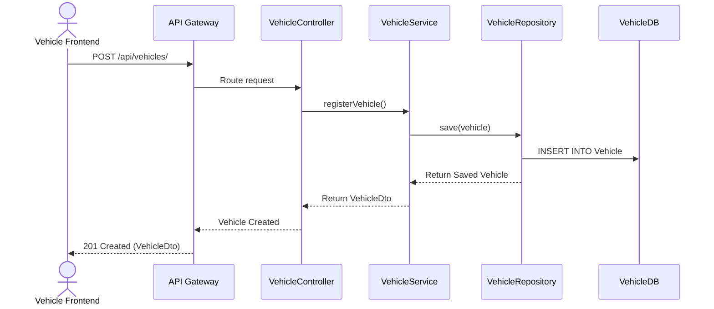

# Vehicle Service

## Contributor
- Siddhi Kate

## 📚 Table of Contents
- [Overview](#overview)
- [Features](#features)
- [Folder Structure](#folder-structure)
- [REST API Endpoints](#rest-api-endpoints)
- [Data Model](#data-model)
- [Module Architecture Diagram](#module-architecture-diagram)
- [Component Diagram](#component-diagram)
- [Sequence Diagram](#sequence-diagram)
- [Swagger Documentation](#swagger-documentation)
- [Run Locally](#run-locally)

---

## Overview
The Vehicle Service is a Spring Boot microservice within the Vehicle Management System. It handles vehicle registration, updates, retrieval, and deletion. It communicates with the User Service via Feign Client and is registered with Eureka for service discovery.

---

## Features

- Register new vehicles with user association
- Update and delete vehicle records
- Retrieve vehicle details by ID or user
- Integrated with User Service via Feign Client
- Registered with Eureka Discovery
- Routed via API Gateway

---

## Folder Structure

```plaintext
src/
└── main/
    ├── java/
    │   └── com.vehicle.service/
    │       ├── config/            # Configuration classes (e.g., Feign, Swagger)
    │       ├── controller/        # REST controllers
    │       ├── dto/               # Data Transfer Objects
    │       ├── entity/            # JPA Entities
    │       ├── repository/        # Spring Data Repositories
    │       └── service/           # Business logic layer
    └── resources/
        └── application.properties  # App configuration
```

---

## REST API Endpoints

| Method | Endpoint                                | Description                          |
|--------|-----------------------------------------|--------------------------------------|
| POST   | `/api/vehicles/`                        | Add a new vehicle                    |
| GET    | `/api/vehicles/user/{userId}`           | Retrieve vehicles by user ID         |
| GET    | `/api/vehicles/{vehicleId}`             | Retrieve vehicle by vehicle ID       |
| PUT    | `/api/vehicles/{vehicleId}`             | Update vehicle details               |
| DELETE | `/api/vehicles/{vehicleId}`             | Delete a vehicle                     |

---

## Data Model

### Vehicle Entity

| Field Name          | Data Type      | Description                              |
|---------------------|----------------|------------------------------------------|
| `vehicleId`         | BIGINT         | Primary Key, auto-generated              |
| `userId`            | BIGINT         | Foreign Key referencing User             |
| `make`              | VARCHAR(255)   | Manufacturer of the vehicle              |
| `model`             | VARCHAR(255)   | Model name of the vehicle                |
| `year`              | INT            | Manufacturing year                       |
| `registrationNumber`| VARCHAR(50)    | Unique registration number               |

---

## Module Architecture Diagram



_This diagram illustrates the layered architecture:_

- API Gateway routes requests  
- VehicleController handles HTTP requests  
- Business logic sits in VehicleService  
- Data access is handled by VehicleRepository  
- Data is persisted to an MySQL database  
- The service is registered with Eureka for discovery

---

## Component Diagram



---

## Sequence Diagram

### Vehicle Registration



---

## Swagger Documentation

The Vehicle Service provides interactive API documentation using Swagger.

### Access Swagger UI

- Swagger UI for Vehicle Service
    http://localhost:8083/swagger-ui/index.html

---

## Run Locally

```bash
# Backend
cd vehicle-service
mvn clean install
mvn spring-boot:run
```
